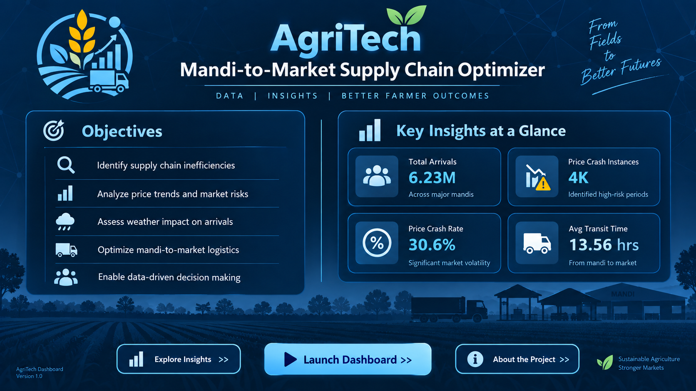
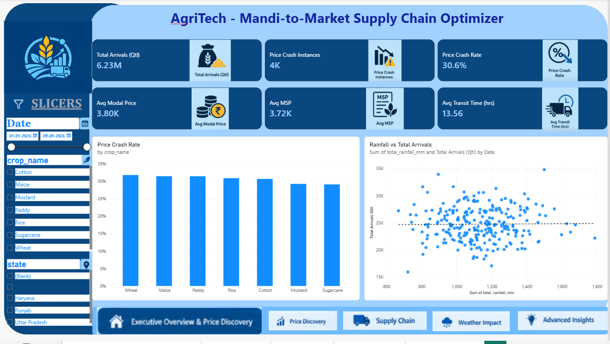
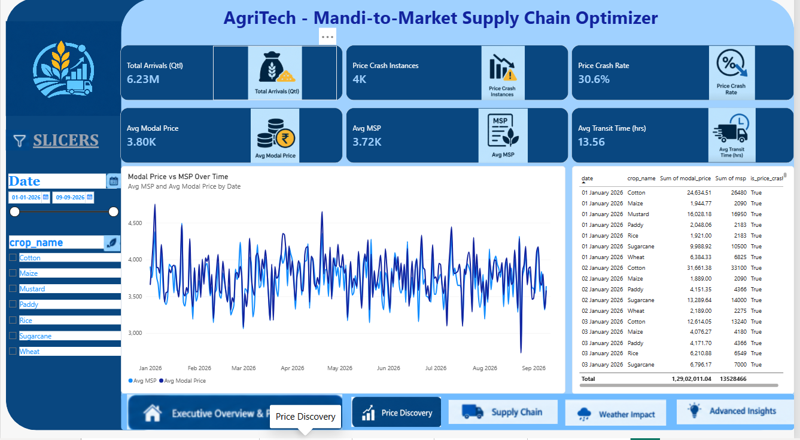
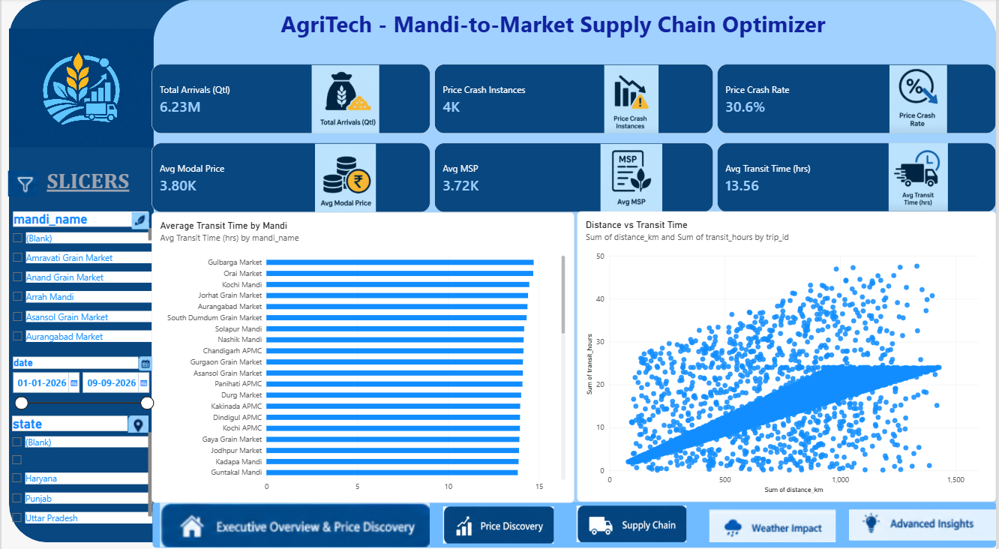
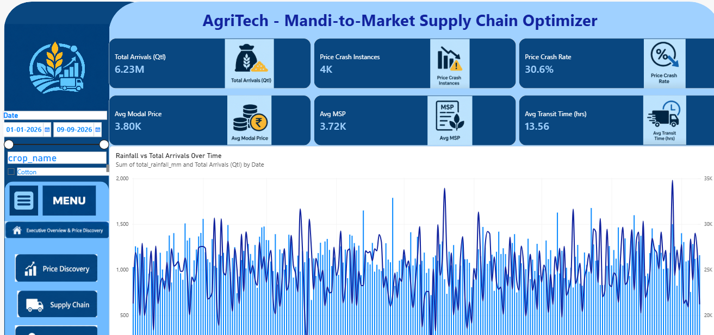
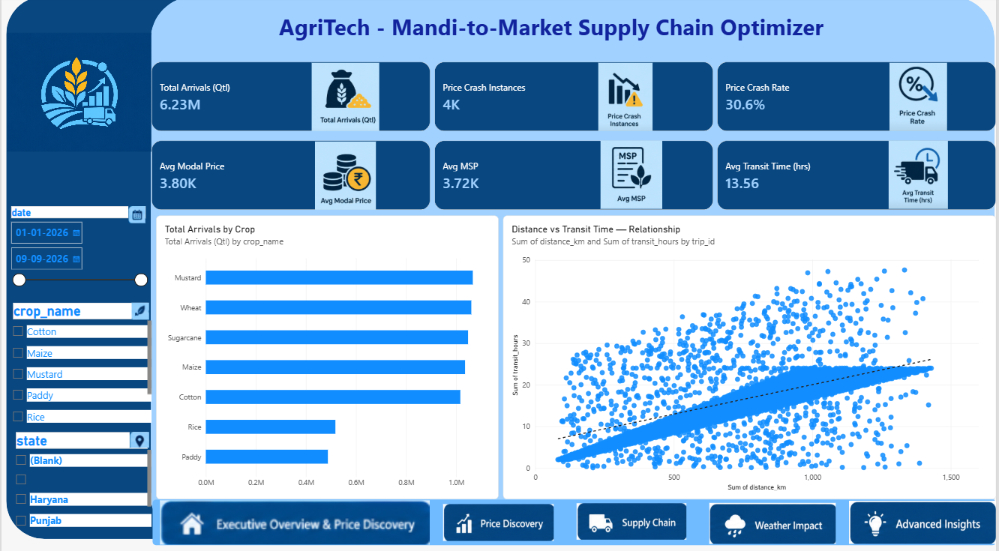

# Track 3 – AgriTech: Mandi-to-Market Supply Chain Optimizer

TransOrg AgentIQ Datathon submission. Takes messy, real-world mandi/crop data and transforms it into a clean, query-ready analytics layer, with a Power BI dashboard on top and an optional text-to-chart AI agent.

> **Note:** This is a data cleaning + Power BI analytics project, not a production system. All major cleaning decisions and assumptions are documented in `docs/data_dictionary.md` and `docs/cleaning_report.md` so the pipeline is auditable and reproducible.
> 
🔗 **Live Dashboard:** _coming soon — will be linked here once published_


🔗 **Live AI Analytics Agent:** https://agri-tech-mandi-to-market-supply-chain-optimizer-egapmnofzfnzc.streamlit.app/

---

## 📊 Project Overview

- **Source files cleaned:** 5 raw datasets → 5 query-ready CSVs
- **Domains covered:** Mandi arrivals, price vs. MSP, transport/logistics, weather
- **Core metrics:** Total arrivals (Quintals), Modal Price vs. MSP, Price Crash instances, Transit time & delay rate, Top mandis by volume
- **Data source:** Raw CSV, JSON and Excel files containing mandi, crop, arrival, price, transport and weather data with inconsistent formats.

---

## 🗂️ Pipeline Stages

### 1. Raw Data (`raw_data/`)

Contains the five original Track 3 source files used as inputs to the cleaning pipeline.

### 2. Data Rescue (`scripts/clean_pipeline.py`)

Reads the raw files from `raw_data/`, cleans and standardizes them, and generates the final analytics-ready datasets in `data/`.

The pipeline is designed to be reproducible and idempotent.

### 3. Notebook Version (`notebooks/clean_pipeline.ipynb`)

A Jupyter Notebook version of the same cleaning pipeline is provided for easier inspection and demonstration of the data-cleaning process.

### 4. Analytics Layer (`data/`)

Five clean, star-schema-ready CSVs:

- `dim_mandi.csv`
- `fact_arrivals.csv`
- `fact_price_msp.csv`
- `fact_transport.csv`
- `dim_weather_daily.csv`

### 5. Power BI Dashboard

Built on top of the cleaned CSVs, following `docs/star_schema_and_powerbi_guide.md` for relationships, DAX measures, and dashboard design.

The dashboard covers:

- Executive Overview
- Price Discovery
- Supply Chain
- Weather Impact
- Advanced Insights

The Power BI report file is included in the repository for reference and reproducibility.

### 6. Bonus Agent (`bonus_agent/`)

A Streamlit text-to-chart analytics agent. It allows users to ask analytical questions in natural language and generates appropriate visualizations and factual insights.

🔗 **Live AI Analytics Agent:** https://agri-tech-mandi-to-market-supply-chain-optimizer-egapmnofzfnzc.streamlit.app/

---

## 🧮 Key Cleaning Logic

| Issue | Fix |
|---|---|
| Multiple mandi ID formats (`MANDI001`, `MANDI-034`, `mandi_031`, `M017`, `034`) | Normalized to canonical `MANDI0##` format |
| Crop names in English/Hindi/Punjabi and mixed case | Canonical crop mapping applied; original values preserved in `raw_crop_name` |
| Quantities in Tonnes/Quintals/KG, sometimes with the unit embedded in the value | Parsed and converted to Quintals |
| Multiple date formats | Format-specific parsing applied and standardized to dates |
| Negative arrival quantities | Converted to absolute values and flagged with `qty_was_negative` |
| Missing farmer counts | Imputed using the median farmer count for the corresponding crop and flagged |
| Prices such as `₹1,234`, `Rs. 1,234`, `INR 1234`, `1234/-` | Currency symbols, commas and formatting removed and converted to numeric |
| Weather timestamps in UTC/IST | Standardized to IST |
| Temperatures in °C/°F | Standardized to Celsius |
| Rainfall in mm/inches | Standardized to millimeters |
| Negative/impossible rainfall values | Set to missing |
| Vehicle numbers with inconsistent spacing/casing | Standardized to `SS-NN-LL-NNNN` where valid |
| Exact duplicate records | Removed |
| Missing arrival IDs | Synthetic IDs generated and flagged |
| Missing transport distance units | Assumed to be km and flagged |
| No sensor → mandi/district mapping | No artificial mapping created; weather aggregated to a national daily series |

Full details and reasoning are documented in:

- `docs/data_dictionary.md`
- `docs/cleaning_report.md`

---

## 🛠️ Tech Stack

- **Python (pandas, numpy, openpyxl)** – data cleaning and transformation
- **Jupyter Notebook** – interactive pipeline documentation
- **Power BI Desktop** – data modeling, DAX measures and dashboard design
- **Streamlit + Plotly** – text-to-chart AI agent

---

## 📁 Repository Structure

```text
track3_clean/
│
├── README.md
│
├── AgriTech-Mandi-to-Market-Supply-Chain-Optimizer.pbix
│
├── raw_data/
│   ├── track3_mandi_arrivals.csv
│   ├── track3_mandi_master.csv
│   ├── track3_price_and_msp.json
│   ├── track3_weather_sensors.xlsx
│   └── track3_transport_logistics.csv
│
├── data/
│   ├── dim_mandi.csv
│   ├── fact_arrivals.csv
│   ├── fact_price_msp.csv
│   ├── fact_transport.csv
│   └── dim_weather_daily.csv
│
├── scripts/
│   └── clean_pipeline.py
│
├── notebooks/
│   └── clean_pipeline.ipynb
│
├── docs/
│   ├── data_dictionary.md
│   ├── cleaning_report.md
│   └── star_schema_and_powerbi_guide.md
│
├── bonus_agent/
│   ├── app.py
│   ├── requirements.txt
│   └── README.md
│
└── images/
    ├── cover_page.png
    ├── executive_overview.png
    ├── price_discovery.png
    ├── supply_chain.png
    ├── weather_impact.png
    └── advanced_insights.png
```

---

## ▶️ How to Run

### Cleaning Pipeline

The cleaned CSVs are already in `data/`, so running the pipeline is optional.

```bash
pip install pandas numpy openpyxl
python scripts/clean_pipeline.py
```

### Power BI Dashboard

Open the Power BI report file included in the repository:

```text
AgriTech-Mandi-to-Market-Supply-Chain-Optimizer.pbix
```

The report is built on the cleaned CSVs in `data/`.

For the data model, relationships, DAX measures and dashboard guidance, see:

```text
docs/star_schema_and_powerbi_guide.md
```

### Bonus AI Agent

```bash
pip install -r bonus_agent/requirements.txt
streamlit run bonus_agent/app.py
```

🔗 **Live AI Analytics Agent:** https://agri-tech-mandi-to-market-supply-chain-optimizer-egapmnofzfnzc.streamlit.app/

---

## 📸 Preview

| Cover | Executive Overview |
|---|---|
|  |  |

| Price Discovery | Supply Chain |
|---|---|
|  |  |

| Weather Impact | Advanced Insights |
|---|---|
|  |  |

---

## 🚀 Future Improvements

- Add district-level weather mapping once sensor metadata is available
- Automate cleaning + refresh on a schedule instead of manual re-runs
- Add year-over-year arrival and price trend comparisons as more seasons of data come in
- Expand the AI agent with conversational follow-up questions, forecasting and anomaly detection
